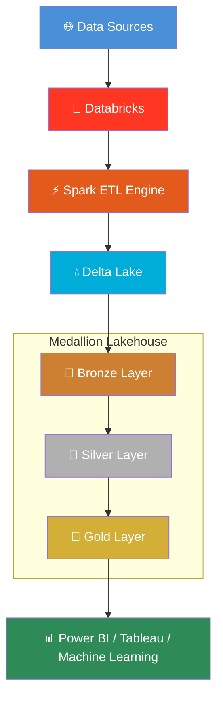
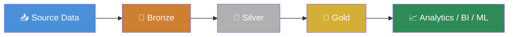

<div align="center">

# 🛒 E-Commerce Data Engineering Pipeline

### A Production-Grade Medallion Architecture Pipeline built with Databricks, Apache Spark & Delta Lake

[](https://www.python.org/)
[](https://spark.apache.org/)
[](https://www.databricks.com/)
[](https://delta.io/)
[](https://www.iso.org/standard/76583.html)
[](#)
[](#-license)

*An end-to-end ETL pipeline transforming raw e-commerce data into analytics-ready insights — following industry-standard Lakehouse and Medallion Architecture principles.*

</div>

---

## 📑 Table of Contents

- [Overview](#-overview)
- [Architecture Diagram](#-architecture-diagram)
- [Data Flow](#-data-flow)
- [Pipeline Architecture](#-pipeline-architecture)
- [ETL Process](#-etl-process)
- [Features](#-features)
- [Technologies](#-technologies)
- [Project Structure](#-project-structure)
- [Key Concepts](#-key-concepts)
- [Business Value](#-business-value)
- [Future Improvements](#-future-improvements)
- [Installation](#-installation)
- [Usage](#-usage)
- [Screenshots](#-screenshots)
- [License](#-license)
- [Author](#-author)

---

## 📖 Overview

This project demonstrates the **design and implementation of a complete Data Engineering pipeline** for an e-commerce platform, built on the **Medallion Architecture** (**Bronze → Silver → Gold**) using **Databricks**.

The pipeline ingests raw e-commerce data, cleans and standardizes it, applies business logic, and produces **analytics-ready, star-schema tables** for downstream reporting, BI, and Machine Learning use cases — powered by **Apache Spark (PySpark)** and **Delta Lake**.

The project follows modern **ETL best practices**, with a strong emphasis on:

| Principle | Description |
|---|---|
| ⚙️ **Scalability** | Built on distributed Spark processing, capable of handling growing data volumes |
| 🧩 **Modularity** | Clear separation between ingestion, transformation, and business logic layers |
| 🛠️ **Maintainability** | Clean, reusable, well-documented PySpark code |
| 🚀 **Performance** | Delta Lake optimizations (partitioning, caching, incremental loads) |
| ✅ **Reliability** | Schema enforcement and data quality validation at every layer |

---

## 🏗️ Architecture Diagram



---

## 🔄 Data Flow



> The pipeline moves data through progressively refined layers — from raw, untouched records in **Bronze**, to cleaned and validated data in **Silver**, to business-ready, aggregated datasets in **Gold**.

---

## 🏛️ Pipeline Architecture

<table>
<tr>
<td width="33%" valign="top">

### 🥉 Bronze Layer
*Raw / Landing Zone*

- Raw data ingestion from source systems
- Schema inference & validation
- Minimal transformations (append-only)
- Immutable raw storage for full historical traceability
- Preserves original data fidelity for reprocessing

</td>
<td width="33%" valign="top">

### 🥈 Silver Layer
*Cleaned & Conformed*

- Data cleaning & standardization
- Null handling strategies
- Duplicate detection & removal
- Type casting & schema enforcement
- Data quality validation checks
- Business-level transformations

</td>
<td width="33%" valign="top">

### 🥇 Gold Layer
*Business-Ready*

- Star schema modeling
- Dimension tables (customers, products, dates)
- Fact tables (orders, transactions)
- Pre-aggregated business metrics
- Analytics & reporting-ready datasets

</td>
</tr>
</table>

---

## ⚙️ ETL Process

<details>
<summary><strong>📥 Extract</strong></summary>

<br>

Raw e-commerce data (orders, customers, products, transactions) is extracted from source files/systems and ingested into the **Bronze layer** using Spark's distributed readers. Data is captured "as-is," preserving the original schema and structure for auditability.

</details>

<details>
<summary><strong>🔧 Transform</strong></summary>

<br>

Data moves from **Bronze to Silver** through a series of PySpark transformations: null handling, deduplication, standardization of formats (dates, currencies, categorical values), and enforcement of a validated schema. Business rules are then applied to shape the **Gold layer**, producing dimensional models (star schema) optimized for analytical queries.

</details>

<details>
<summary><strong>📤 Load</strong></summary>

<br>

Transformed data is loaded into **Delta Tables**, which provide ACID transactions, schema evolution, time travel, and efficient upserts (`MERGE INTO`). Each layer is persisted as versioned Delta tables, enabling reliable incremental processing and rollback if needed.

</details>

### Spark DataFrames & Delta Tables in the Pipeline

Throughout the pipeline, **Spark DataFrames** serve as the core in-memory abstraction for distributed transformations — filtering, joining, aggregating, and applying business logic at scale. Each processed DataFrame is persisted as a **Delta Table**, which brings warehouse-grade reliability (ACID compliance, schema enforcement, and time travel) to the data lake. This combination allows the pipeline to safely perform **incremental (upsert-based) loads** rather than full reprocessing, significantly improving performance and cost-efficiency as data volume grows.

---

## ✨ Features

| Feature | Description |
|---|---|
| 🔁 **End-to-End ETL Pipeline** | Complete flow from raw ingestion to business-ready datasets |
| 🏗️ **Medallion Architecture** | Industry-standard Bronze → Silver → Gold design pattern |
| ➕ **Incremental Data Processing** | Efficient upserts using Delta Lake `MERGE` operations |
| 💧 **Delta Lake Support** | ACID transactions, schema evolution, and time travel |
| 🧹 **Data Cleaning** | Standardization, null handling, and deduplication logic |
| ✅ **Data Validation** | Automated data quality checks at each layer |
| 🛡️ **Schema Enforcement** | Prevents corrupt or malformed data from entering the pipeline |
| 🔍 **Spark SQL** | Declarative querying and business logic on Delta Tables |
| 🧩 **Modular Code Structure** | Reusable, testable functions across layers |
| 📈 **Scalable Data Processing** | Distributed computation designed for growing datasets |
| 🏭 **Production-Ready Design** | Follows real-world Data Engineering best practices |

---

## 🛠️ Technologies

| Category | Tools |
|---|---|
| **Compute Platform** | Databricks |
| **Processing Engine** | Apache Spark (PySpark) |
| **Storage Layer** | Delta Lake |
| **Query Language** | SQL |
| **Programming Language** | Python |
| **Version Control** | Git & GitHub |
| **Design Pattern** | Medallion Architecture |
| **Methodology** | ETL Pipeline / Data Engineering Best Practices |

---

## 📂 Project Structure

```
E-Commerce-Data-Engineering-Pipeline/
│
├── Bronze/                    # Raw data ingestion scripts (Bronze layer logic)
│   └── bronze_ingestion.py
│
├── Silver/                    # Data cleaning & transformation scripts (Silver layer logic)
│   └── silver_transformation.py
│
├── Gold/                      # Business logic, star schema & aggregations (Gold layer logic)
│   ├── gold_dim_customers.py
│   ├── gold_dim_products.py
│   └── gold_fact_orders.py
│
├── notebooks/                 # Databricks notebooks orchestrating each pipeline stage
│   ├── 01_bronze_ingestion.ipynb
│   ├── 02_silver_transformation.ipynb
│   └── 03_gold_aggregation.ipynb
│
├── utils/                     # Shared helper functions (Spark session, logging, DQ checks)
│   ├── spark_session.py
│   ├── logger.py
│   └── data_quality_checks.py
│
├── images/                    # Architecture diagrams & pipeline screenshots
│   ├── architecture_diagram.png
│   └── pipeline_screenshot.png
│
├── requirements.txt           # Python dependencies
├── LICENSE                    # MIT License
└── README.md                  # Project documentation
```

| Folder / File | Purpose |
|---|---|
| `Bronze/` | Handles raw ingestion of source data with minimal transformation, preserving immutability |
| `Silver/` | Contains cleaning, validation, and standardization logic that produces conformed datasets |
| `Gold/` | Builds the star schema — dimension and fact tables — for analytics and reporting |
| `notebooks/` | Databricks notebooks that orchestrate and execute each layer end-to-end |
| `utils/` | Reusable utility modules (Spark session setup, logging, data quality functions) |
| `images/` | Visual assets referenced in the documentation (diagrams, screenshots) |
| `requirements.txt` | Python package dependencies for local development/testing |
| `LICENSE` | Open-source license governing use of this project |

---

## 📚 Key Concepts

<details>
<summary><strong>Click to expand definitions</strong></summary>

<br>

| Concept | Explanation |
|---|---|
| **Apache Spark** | A distributed computing engine for large-scale data processing, enabling parallel transformations across clusters |
| **Databricks** | A unified Lakehouse platform that hosts Spark clusters, notebooks, and Delta Lake storage in one collaborative environment |
| **Delta Lake** | An open-source storage layer that brings ACID transactions, schema enforcement, and time travel to data lakes |
| **ETL** | The process of **E**xtracting data from sources, **T**ransforming it into a usable form, and **L**oading it into a target system |
| **Medallion Architecture** | A layered data design pattern (Bronze/Silver/Gold) that incrementally improves data quality and structure |
| **Data Lakehouse** | An architecture combining the low-cost storage of data lakes with the reliability and structure of data warehouses |
| **DataFrames** | A distributed, tabular in-memory data structure in Spark used to perform transformations at scale |
| **Delta Tables** | Tables backed by Delta Lake, providing versioning, reliability, and efficient upserts on top of Parquet files |

</details>

---

## 💼 Business Value

| Dimension | Impact |
|---|---|
| **Scalability** | Distributed Spark processing supports growing data volumes without redesigning the pipeline |
| **Reliability** | Delta Lake's ACID transactions ensure consistent, corruption-free data even during concurrent writes |
| **Data Quality** | Validation checks at each layer catch issues early, reducing downstream reporting errors |
| **Performance** | Incremental processing and Delta optimizations reduce compute cost and processing time |
| **Analytics** | The Gold layer's star schema enables fast, intuitive BI queries and dashboards |
| **Maintainability** | Modular, layer-based code structure simplifies debugging, testing, and future enhancements |

---

## 🚧 Future Improvements

- [ ] **Streaming Ingestion** — Real-time data ingestion using Spark Structured Streaming
- [ ] **Auto Loader** — Incremental and efficient cloud file ingestion
- [ ] **Delta Live Tables (DLT)** — Declarative pipeline orchestration with built-in quality checks
- [ ] **Unity Catalog** — Centralized data governance and access control
- [ ] **Data Quality Monitoring** — Automated alerting for data drift and anomalies
- [ ] **CI/CD Integration** — Automated testing and deployment pipelines
- [ ] **Apache Airflow** — Workflow orchestration and scheduling
- [ ] **Azure Data Factory** — Cloud-native orchestration and hybrid data movement
- [ ] **Machine Learning Integration** — Feature engineering and model training on Gold datasets
- [ ] **MLOps** — Automated model deployment, monitoring, and retraining pipelines


---


## 👤 Author

**Zaki**
Data Scientist & AI Engineer | M.Sc. in Data Science & Artificial Intelligence
University of Abdelhamid Mehri – Constantine 2, Algeria (2026)

Passionate about building scalable, production-grade data systems that bridge raw data and actionable business insight — with hands-on experience across Data Engineering, Machine Learning, and NLP.


---

<div align="center">

⭐ **If you found this project useful, consider giving it a star!** ⭐

</div>
